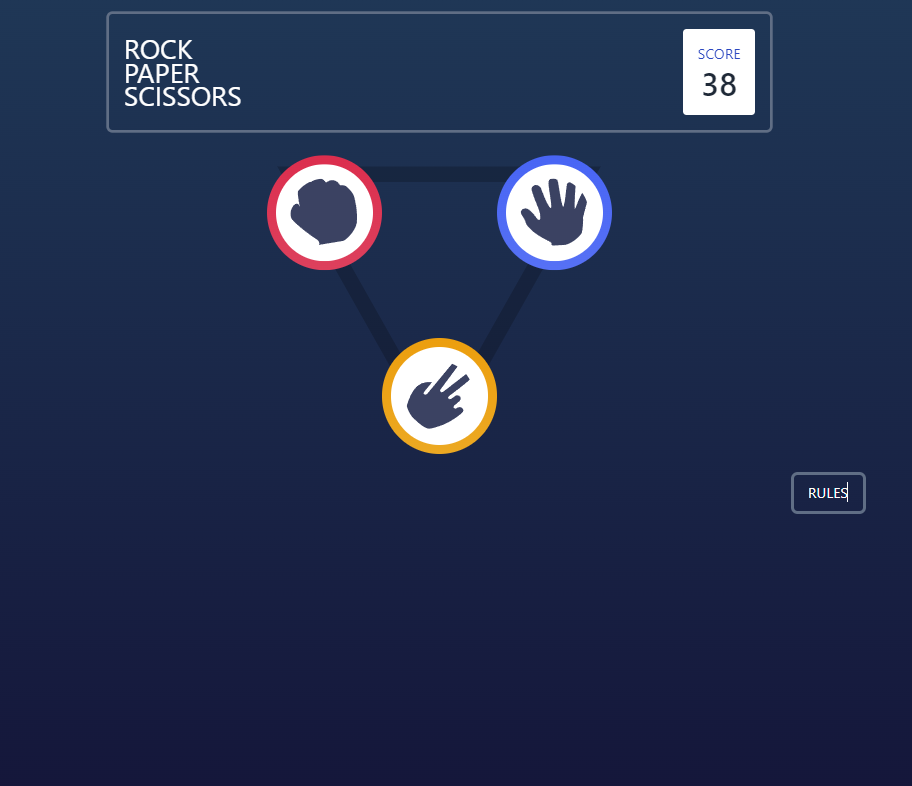

# Frontend Mentor - Rock, Paper, Scissors solution

This is a solution to the [Rock, Paper, Scissors challenge on Frontend Mentor](https://www.frontendmentor.io/challenges/rock-paper-scissors-game-pTgwgvgH). Frontend Mentor challenges help you improve your coding skills by building realistic projects. 

## Table of contents

- [Overview](#overview)
  - [The challenge](#the-challenge)
  - [Screenshot](#screenshot)
  - [Links](#links)
- [My process](#my-process)
  - [Built with](#built-with)
  - [What I learned](#what-i-learned)
  - [Continued development](#continued-development)
  - [Useful resources](#useful-resources)
- [Author](#author)

## Overview

### The challenge

Users should be able to:

- View the optimal layout for the game depending on their device's screen size
- Play Rock, Paper, Scissors against the computer
- Maintain the state of the score after refreshing the browser _(optional)_
- **Bonus**: Play Rock, Paper, Scissors, Lizard, Spock against the computer _(optional)_

### Screenshot



### Links

- Solution URL: [Github Code](https://github.com/alihaghjou/rock-paper-scissor)
- Live Site URL: [Live Solution at Netlify](https://wondrous-pudding-112215.netlify.app/)

## My process

### Built with

- Semantic HTML5 markup
- CSS custom properties
- Flexbox
- CSS Grid
- [React](https://reactjs.org/) - JS library
- [TailwindCss](https://tailwindcss.com/) - CSS library
- [HeadlessUi](https://headlessui.com/) - TailwindCss library

### What I learned

The most interesting and the only thing that i can think of designing border gradient. I learned it just only by googling it.

```css
.scissorBorder {
  background: linear-gradient(white, white) padding-box,
    linear-gradient(to bottom, hsl(39, 89%, 49%), hsl(40, 84%, 53%)) border-box;
  border: 10px solid transparent;
}
```

### Continued development

I will be needing to improve my css design responsiveness.

### Useful resources

- [resource 1](https://codyhouse.co/nuggets/css-gradient-borders) - This helped me for designing the border gradient. Make sure to check it out.

## Author

- Frontend Mentor - [@alihaghjou](https://www.frontendmentor.io/profile/alihaghjou)
- Github - [@alihaghjou](https://github.com/alihaghjou)